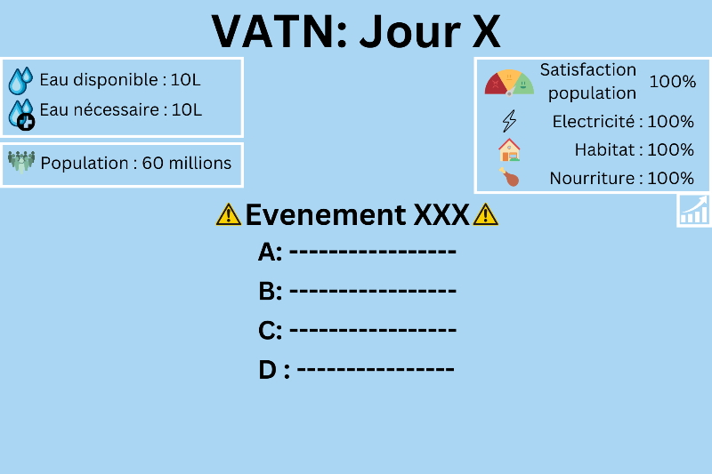
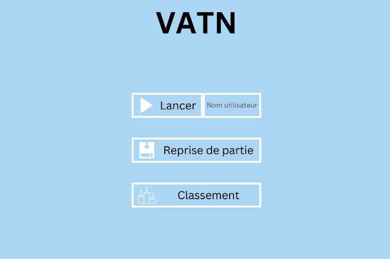
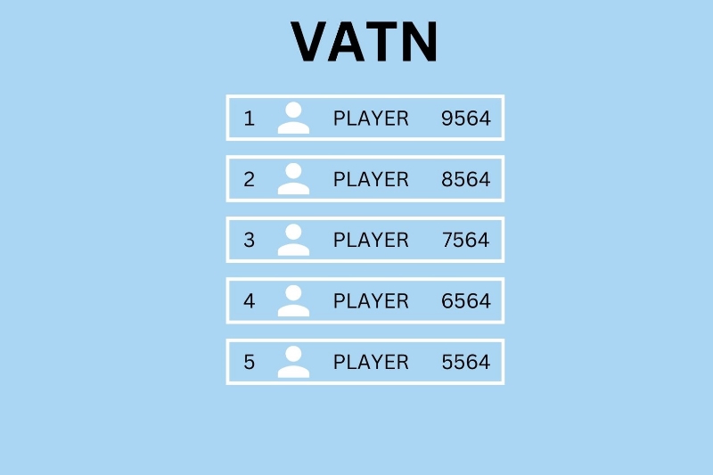

# VATN-WaterGame

## 🚀 Overview

**VATN** (from the Old Norse word for "water") is a game designed to raise awareness about water management. Players must make critical daily decisions to address major water-related issues in their country, influencing key parameters that determine the nation's survival.

## 🎯 Purpose
- 💧 **Water Management Awareness**: Educate players on the importance of sustainable water policies.
- 🎮 **Engaging Decision-Making**: Every day presents a new challenge that affects the nation's status.
- 🏆 **Survival & Strategy**: Keep your country alive as long as possible by maintaining stability.
- 📊 **Progress Tracking**: Visualize the evolution of key parameters through in-game graphs.

## 📝 Features
| 🏷️ Feature        | 🔍 Description |
|----------------|-------------|
| 🌎 **Game Type** | Strategic Decision-Making Simulation |
| 📅 **Daily Choices** | Players make decisions each day affecting country parameters |
| 📉 **Dynamic Statistics** | Key indicators fluctuate based on player actions |
| 💀 **Game Over** | The country collapses if the population reaches 0 |
| 📂 **Save & Load** | Resume previous games using saved files |
| 🏅 **Rankings** | Compare results with previous local games |
| 📊 **Graphical Summary** | Track country status evolution over time |

## 📺 Gameplay Overview
| 🎮 Main Menu | 📊 In-Game Statistics | 🏆 Endgame Rankings |
|-----------|-----------|-----------|
|  |  |  |

## 🌟 License
This project is open-source. Feel free to use, modify, and contribute! 🚀

